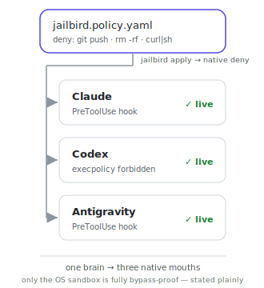
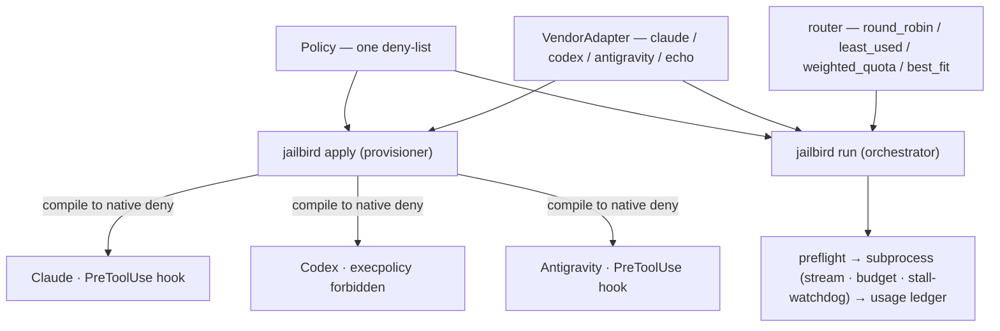

<picture>
  <source media="(prefers-color-scheme: dark)" srcset="assets/logo-dark.svg">
  
</picture>

<table>
<tr>
<td width="58%" valign="top">

**Govern a fleet of coding agents across vendors — behind one policy.**

Headless coding agents run shell commands, push branches, and rewrite files on their own — and each vendor governs (and bills) them differently. jailbird puts one deny-policy, one usage-balanced router, and one set of role→vendor workflows in front of Claude, Codex, and Antigravity, so you run a governed, auditable fleet — not a pile of unsupervised agents.

- **Govern, don't trust.** One deny-list compiles to each vendor's strongest native enforcement — proven live on all three. Autonomy never means bypass: the harness never passes a flag that disables safety.
- **Spread the load.** A usage-balanced router exhausts your subscriptions evenly — round-robin, least-used, or weighted by remaining quota.
- **Compose a team.** Claude designs → Codex implements → Antigravity QAs, with enforcing QA gates. Tailor which model owns which role.

   

[Govern](#govern) · [Route](#route) · [Compose](#compose) · [Capability matrix](#capability-matrix) · [Install](#quickstart)

</td>
<td width="42%" valign="top">

<picture>
  <source media="(prefers-color-scheme: dark)" srcset="assets/hero-flow-dark.svg">
  
</picture>

</td>
</tr>
</table>

## Quickstart

Offline, no credentials — the `echo` vendor is a deterministic mock, so every example and the whole test suite run with zero credentials.

```bash
pip install -e ".[dev]"
jailbird run --vendor echo --prompt "summarize what jailbird does"
```

Point adapters at the real CLIs (`claude`, `codex`, `agy`) to go live.

## See it run

One cast, offline on the `echo` vendor: one policy compiles to every vendor's native deny, a denied `git push` is refused at preflight, and the usage-balanced router picks the least-used vendor.



## Govern

One deny-list compiles to each vendor's strongest native enforcement:

```bash
jailbird apply --policy jailbird.policy.yaml --vendors claude codex antigravity
```

- **Claude** — `PreToolUse` hook
- **Codex** — execpolicy `forbidden` rules (the deny that holds under `codex exec`, where hooks are inert)
- **Antigravity** (`agy`) — `PreToolUse` hook (`.agents/hooks.json`), fires and blocks headlessly

All three are **proven live** — a real CLI was blocked from running a denied command. See the [capability matrix](#capability-matrix) for exactly what each layer guarantees; only the OS/container sandbox is truly bypass-proof, and the harness never passes a flag that disables governance.

## Route

Spread work across vendors to exhaust subscriptions evenly:

```bash
jailbird route --vendors claude codex antigravity --strategy weighted_quota
```

Strategies: `round_robin`, `least_used`, `weighted_quota` (weight by remaining configured budget), `best_fit`. The default `QuotaSource` is a local budget-cap ledger — not a live billing API.

## Compose

Tailor which model owns which role, then run it as a governed, usage-routed pipeline:

```bash
jailbird run --workflow workflows/design-build-qa.yaml --profile jailbird.profile.yaml \
  --task "add a /healthz endpoint with a test"
```

Claude designs → Codex implements → Antigravity QAs, with an **enforcing** QA gate (`--no-gate` to disable). Tune the role→vendor map in `jailbird.profile.yaml`.

Here's a **real run** (claude → codex → antigravity, in an isolated throwaway directory, ~$0.13): claude writes a design, codex implements it and runs the tests, and antigravity's review catches a real bug.



## Call it from your coding agent

The bundled `jailbird-apply` skill lets an agent self-provision its own governance — or launch a governed worker on any vendor:

```text
# In Claude Code — the agent self-governs before it touches anything:
> "Apply jailbird governance: deny git push and rm -rf, then implement the plan."
  → runs  jailbird apply --policy no-push.policy.yaml --vendors claude
  ✓ .claude/settings.json — PreToolUse deny-hook installed

# Or launch a governed worker on any vendor (Codex / Antigravity / Claude):
jailbird run --vendor codex --policy no-push.policy.yaml \
  --task "refactor the parser — do not push"
```

## Capability matrix

Honest, per-vendor — only the OS/container sandbox is truly bypass-proof:

| Vendor | Governance deny (live) | Mechanism |
|---|---|---|
| **Claude** | ✅ proven | `PreToolUse` hook |
| **Codex** | ✅ proven | execpolicy `forbidden` (hooks are inert under `codex exec`) |
| **Antigravity** | ✅ proven | `PreToolUse` hook (`.agents/hooks.json`) |

Full layer-by-layer guarantees, the live-validation detail, and the honest Codex limitation (`deny_tools` is hook-only, so it is not enforced under `codex exec` — `deny_commands` via execpolicy is) live in [docs/CAPABILITY-MATRIX.md](docs/CAPABILITY-MATRIX.md). The standalone Gemini CLI adapter was removed (auth-ineligible); Gemini models are reached and governed through `agy`.

## Architecture

Two surfaces over one shared core — `apply` provisions governance, `run` orchestrates governed workers; both share the `Policy` + `VendorAdapter` layer.



## Honest limitations

- **Codex `deny_tools` is not enforced under `codex exec`** — `PreToolUse` hooks are inert there (upstream [openai/codex#25875](https://github.com/openai/codex/issues/25875), [#18607](https://github.com/openai/codex/issues/18607)); the live deny is the execpolicy layer (`deny_commands`). Hook-based `deny_tools` is enforced for Claude.
- **Only the OS/container sandbox is truly bypass-proof.** Command-string denylists are best-effort (absolute paths, `bash -c`, Unicode). See [docs/SANDBOX.md](docs/SANDBOX.md).
- **The router models remaining configured budget**, not a live vendor billing API; the `QuotaSource` seam is where a real probe plugs in.

## The repo governs itself

jailbird applies its own medicine: a 5-layer secret-leak prevention system — a hardened `.gitignore`, `pre-commit`/`pre-push` guards, a gitleaks CI scan, a one-shot pre-publish check, and `SECURITY.md`. A deny-hook, for git.

## Testing

```bash
ruff check . && mypy jailbird && pytest -v
```

Everything runs offline via the `echo` adapter — no credentials. The example `run.sh` scripts are executed in CI (`tests/test_run_scripts.py`).

## Composes with

jailbird does not rebuild model/billing routing — it composes with [claude-code-router](https://github.com/musistudio/claude-code-router), [LiteLLM](https://github.com/BerriAI/litellm), and [ccusage](https://github.com/ryoppippi/ccusage), adding the governed cross-vendor worker + usage balancer on top.

## License

[MIT](LICENSE).
